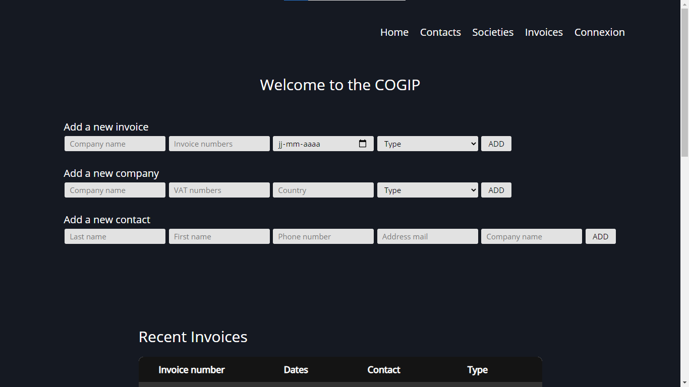
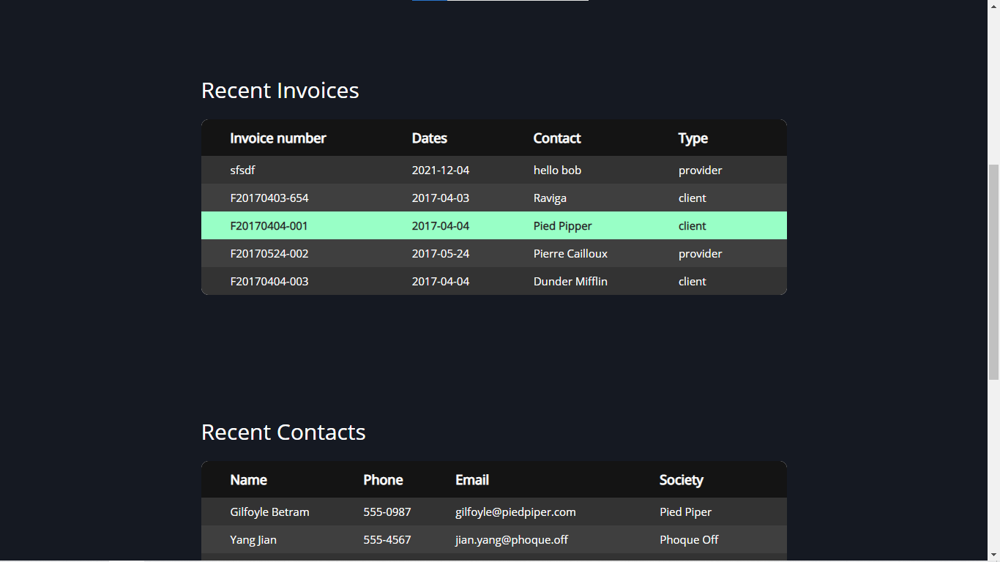

<h1 align="center">Cogip</h1>

 
 
 
 
 
 

<!-- TABLE OF CONTENTS -->

	
Table of Contents

	<ol>
		<li><a href="#About-Cogip">About Cogip</a></li>
		<li><a href="#The-mission">The mission</a></li>
		<li><a href="#How-it-was-developed">How it was developed</a>
			<ul>
			<li><a href="#First-we-have-the-main-parts">First we have the main parts</a></li>
			<li><a href="#Then-there-are-the-secondary-parts">Then there are the secondary parts</a></li>
			</ul>
		</li>
		<li><a href="#Collaborators">Collaborators</a></li>
	</ol>

# About Cogip

COGIP is a company that produces Jean-Michel toys.
The accounting employees of COGIP use an old and incomplete software with a poor design.

# The mission

Update the database.
Create different administrator space. 
Create a new design for the application.
Rethink the application architecture using the MVC system.

# How it was developed

The application is developed in PHP POO with a look and feel made with CSS/SCSS. 

## First we have the main parts
The application is divided into five main parts:
- Home page
- Contacts page
- Companies page
- Invoices page
- Login page

 **Home page**  
There are three tables containing the last five additions to each.

**Contacts page** 
It contains a table with all the company's contacts.

 **Societies page** 
It contains all the companies classified in two tables: customers and suppliers who work with Cogip.

**Invoice page** 
Contains a table with all the company's invoices.

**Login page** 
Allows you to log in.

## Then there are the secondary parts

**The first one:**  
This is the detail part for companies, invoices and contacts.
When you select an item, it displays a new page with all the data concerning the selected item. 

**The second:**  
This is when the administrator logs in, special options appear. He has the possibility to add, modify and delete data.
<!-- PROJECT LOGO -->
 

  
	

  <h1></h1>

:point_up:&nbsp; <a href="#top">Back to top</a>

